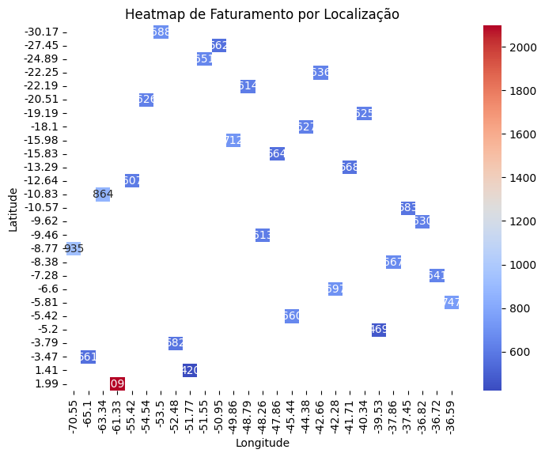
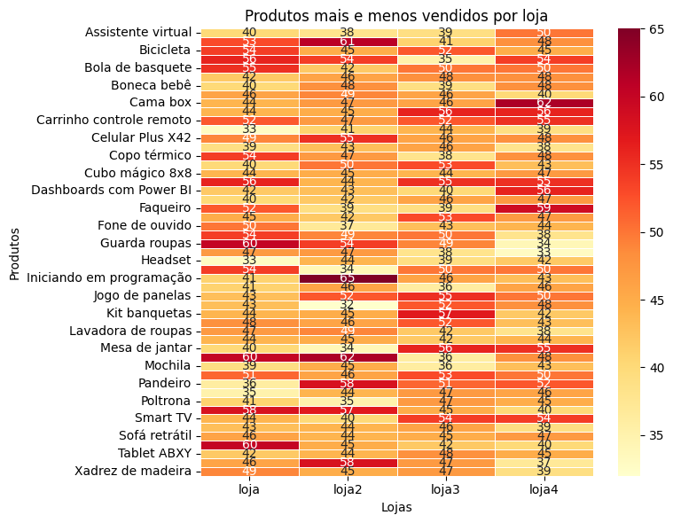

# storeBR

Challenge Alura - Python - Store BR 

## Objetivo

O objetivo do desafio é descobrir qual das 4 lojas o Senhor João deve fechar

## A Base Utilizada

A Base de Dados se encontra em: 
url da loja 1 
"https://raw.githubusercontent.com/alura-es-cursos/challenge1-data-science/refs/heads/main/base-de-dados-challenge-1/loja_1.csv" 
url da loja 2 
"https://raw.githubusercontent.com/alura-es-cursos/challenge1-data-science/refs/heads/main/base-de-dados-challenge-1/loja_2.csv" 
url da loja 3 
"https://raw.githubusercontent.com/alura-es-cursos/challenge1-data-science/refs/heads/main/base-de-dados-challenge-1/loja_3.csv" 
url da loja 4 
"https://raw.githubusercontent.com/alura-es-cursos/challenge1-data-science/refs/heads/main/base-de-dados-challenge-1/loja_4.csv" 
 

## As Bibliotecas

As Bibliotecas utilizadas e seus respectivas versões são:<b>
| Biblioteca | Versão |
|---------|------------|
| pandas | 1.5.3 |
| missingno | 0.5.2 |
| seaborn | 0.13.2 |
| numpy | 1.26.4 |
| folium | 0.17.0 |
| matplotlib | 3.8.3 |

## Principais Informações Geradas

Dentro do item 6.Relatório, é possível ver as principais conclusões do projeto. Abaixo, alguns gráficos de Exemplo:

 
Faturamento Georreferenciado 
 

 
Faturamento Georreferenciado por Loja 
 

 
Venda de Produto por Loja 
 

 

## Como Utilizar

A execução é simples, basta executar todas as ações em sequência e utilizar o item 6.Relatório para acompanhar a análise feita e as conclusões.

## Feito por:

Silverio Oliveira
